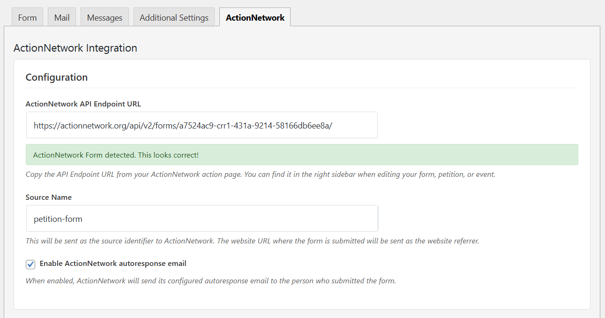
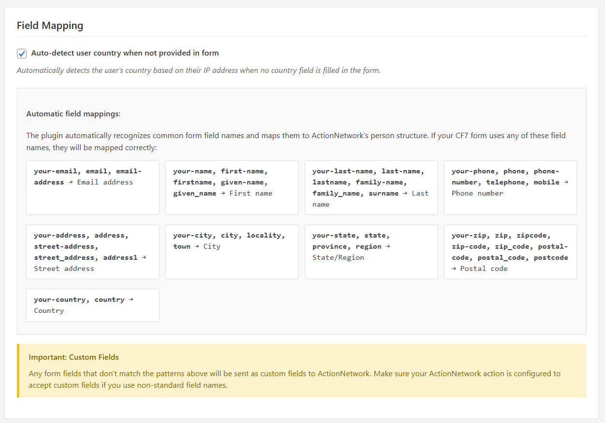
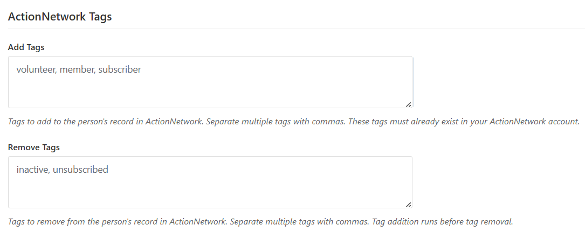

# Form Integration for Action Network and Contact Form 7 #
**Contributors:** [procom.dev](https://procom.dev), [Mário Valney](https://mariovalney.com/me)  
**Tags:** contact form 7, action network, cf7, actionnetwork, integration  
**Official website:** https://github.com/procom-dev/form-integration-for-action-network-and-contact-form-7  
**Requires at least:** 4.7  
**Tested up to:** 6.4  
**Stable tag:** trunk  
**Requires PHP:** 7.4  
**License:** GPLv2 or later  
**License URI:** http://www.gnu.org/licenses/gpl-2.0.html  

Seamlessly connect Contact Form 7 to ActionNetwork with smart field mapping, country detection, and comprehensive tagging support!

## Description ##

[Contact Form 7 (CF7)](https://wordpress.org/plugins/contact-form-7/) is a widely-used plugin by millions of WordPress websites for creating forms. 

The **Form Integration for Action Network and Contact Form 7** plugin provides a powerful bridge between your WordPress forms and ActionNetwork's organizing platform. Designed for nonprofits, advocacy groups, and political campaigns, this plugin automatically maps CF7 form fields to ActionNetwork's person data structure with intelligent field recognition and enhanced features.

### Key Features ###

🎯 **Smart Field Mapping**: Automatically recognizes common form field patterns and maps them to ActionNetwork's standard fields  
🌍 **Auto Country Detection**: Automatically detects user location when country isn't provided in forms  
🏷️ **Advanced Tagging**: Add or remove tags from ActionNetwork contacts with simple configuration  
📧 **Email Integration**: Control ActionNetwork autoresponse emails and skip CF7 emails to prevent duplicates  
🔒 **Security First**: WordPress.org compliant with proper nonces, sanitization, and permission checks  
🎨 **Modern Admin UI**: Clean, responsive interface with real-time URL validation  
📊 **Source Tracking**: Automatic referrer data and custom source identification  
🔄 **Retry Logic**: Built-in exponential backoff for reliable delivery  

Disclaimer: This plugin was created without any encouragement from ActionNetwork or CF7 developers.

### How to Use ###

Setting up the integration is simple:

1. **Create an ActionNetwork Action**: Set up a Form, Petition, Event, Fundraising Page, or Advocacy Campaign in ActionNetwork
2. **Get the API Endpoint**: Copy the API Endpoint URL from the right sidebar when editing your action
3. **Configure CF7 Form**: In Contact Form 7, go to the 'ActionNetwork' tab and paste your URL
4. **Smart Configuration**: The plugin automatically activates when you add a URL - no separate activation needed
5. **Optional Enhancements**: Configure country detection, tags, source tracking, and autoresponse settings

### Supported ActionNetwork Actions ###

The plugin automatically detects and properly formats data for:
- **Forms** → `/submissions`
- **Petitions** → `/signatures` 
- **Events** → `/attendances`
- **Fundraising Pages** → `/donations`
- **Advocacy Campaigns** → `/outreaches`

### Smart Field Mapping ###

The plugin intelligently recognizes common CF7 field names and automatically maps them to ActionNetwork's person structure:

**Email Variations**:
`your-email`, `email`, `email-address` → Email address

**Name Variations**:
`your-name`, `first-name`, `firstname`, `given-name` → First name  
`your-last-name`, `last-name`, `lastname`, `family-name`, `surname` → Last name

**Contact Information**:
`your-phone`, `phone`, `phone-number`, `telephone`, `mobile` → Phone number

**Address Components**:
`your-address`, `address`, `street-address` → Street address  
`your-city`, `city`, `locality`, `town` → City  
`your-state`, `state`, `province`, `region` → State/Region  
`your-zip`, `zip`, `zipcode`, `postal-code` → Postal code  
`your-country`, `country` → Country

**Custom Fields**: Any fields that don't match these patterns are automatically included as custom fields in ActionNetwork.

### Advanced Features ###

**Country Auto-Detection**: When enabled, automatically detects user's country using:
- IP geolocation services
- CloudFlare country headers
- Browser language preferences

**Tag Management**: 
- Add tags to new contacts (comma-separated list)
- Remove specific tags from contacts
- Tag operations run automatically on form submission

**Source Tracking**:
- Configurable source name for campaign tracking
- Automatic referrer URL capture
- Support for `?source=` URL parameters

### Frequently Asked Questions ###

#### Does it work with Gutenberg and WordPress 6+?
Yes! The plugin is fully compatible with modern WordPress (5.0+) and the Gutenberg editor.

#### How do I know if the integration is working?
After submitting a test form, check your ActionNetwork action for new submissions. The plugin automatically handles retries and error logging.

#### Can I use this for non-ActionNetwork webhooks?
This plugin is specifically designed for ActionNetwork's API structure. For general webhooks, consider using [CF7 to Webhook](https://github.com/mariovalney/cf7-to-zapier).

#### How does file upload work?
File uploads are automatically handled - files are copied to a secure directory and the URLs are sent to ActionNetwork before CF7 removes the temporary files.

#### Can I customize field mapping?
Yes! Use the `actionnetwork` option in your CF7 field tags:  
`[text your-field actionnetwork:custom_field_name]`

#### What happens to CF7 emails when integration is active?
By default, CF7 emails are automatically disabled when ActionNetwork integration is configured to prevent duplicate notifications. ActionNetwork autoresponse emails can be controlled separately.

#### How does country detection work?
The plugin tries multiple methods in order:
1. GeoIP functions (if available)
2. Free ipapi.co service
3. CloudFlare country headers
4. Browser language preferences

#### Can I add multiple ActionNetwork URLs?
Yes, you can add multiple URLs (one per line) to send the same form data to different ActionNetwork actions.

### Who is the original developer?
[Mário Valney](https://mariovalney.com/me)
Brazilian developer who is part of the [WordPress community](https://profiles.wordpress.org/mariovalney).

### Can I help you?
Yes! Visit the [GitHub repository](https://github.com/procom-dev/form-integration-for-action-network-and-contact-form-7) to contribute code, report issues, or suggest improvements.

## Screenshots ##

*Main section of the plugin, where you just enter the Action Network API Endpoint.*

 
*The plugin automatically matches your fields from CF7 to the official Action Network's Core Fields.*

*You can also add and remove tags to people submitting your form.*

## Installation ##

1. Install [Contact Form 7](https://wordpress.org/plugins/contact-form-7/) and activate it.
2. Install "Form Integration for Action Network and Contact Form 7" by using the plugins dashboard or upload the entire `form-integration-for-action-network-and-contact-form-7` folder to the `/wp-content/plugins/` directory.
3. Activate the plugin through the 'Plugins' menu in WordPress.
4. You will find the 'ActionNetwork' tab in the form configuration.

## Changelog ##

### 1.0.0 ###
* **Enhanced Integration**: Complete rewrite with improved ActionNetwork API integration
* **Smart Field Mapping**: Automatic recognition of 25+ common field name patterns
* **Country Auto-Detection**: Multiple detection methods for automatic country assignment
* **Advanced Tagging**: Add/remove ActionNetwork tags with simple configuration
* **Security Improvements**: WordPress.org compliant with proper nonces and sanitization
* **Modern Admin UI**: Responsive interface with real-time URL validation
* **Simplified Activation**: Automatic activation when ActionNetwork URL is provided
* **Source Tracking**: Enhanced referrer data and campaign source tracking
* **Retry Logic**: Exponential backoff for reliable API delivery
* **Email Control**: Configurable ActionNetwork autoresponse and CF7 email management
* **Multi-URL Support**: Send form data to multiple ActionNetwork actions
* **Error Handling**: Comprehensive logging and graceful error recovery
* **Performance**: Optimized data processing and reduced overhead